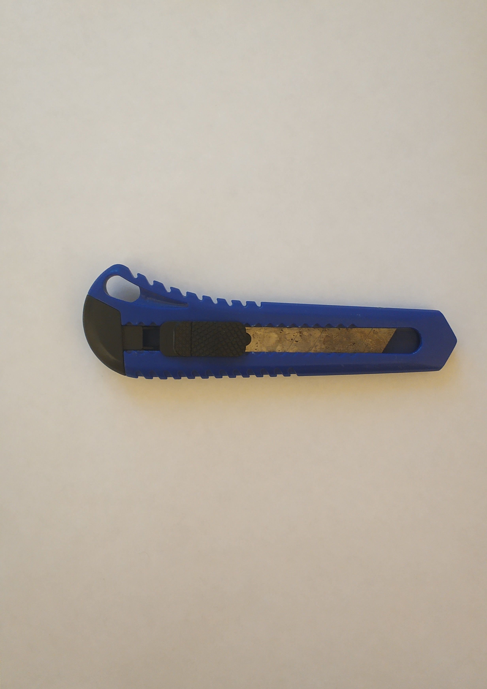
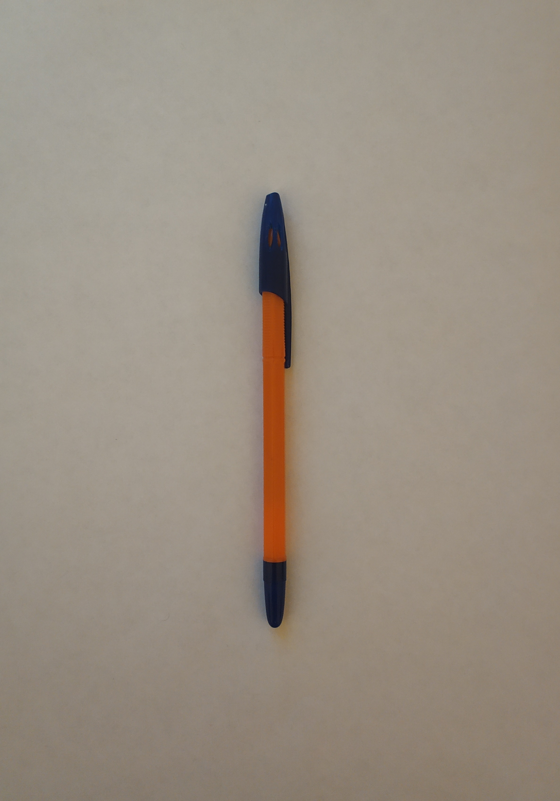
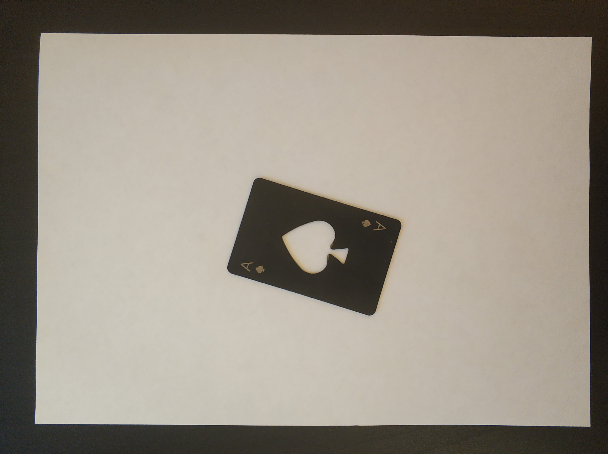
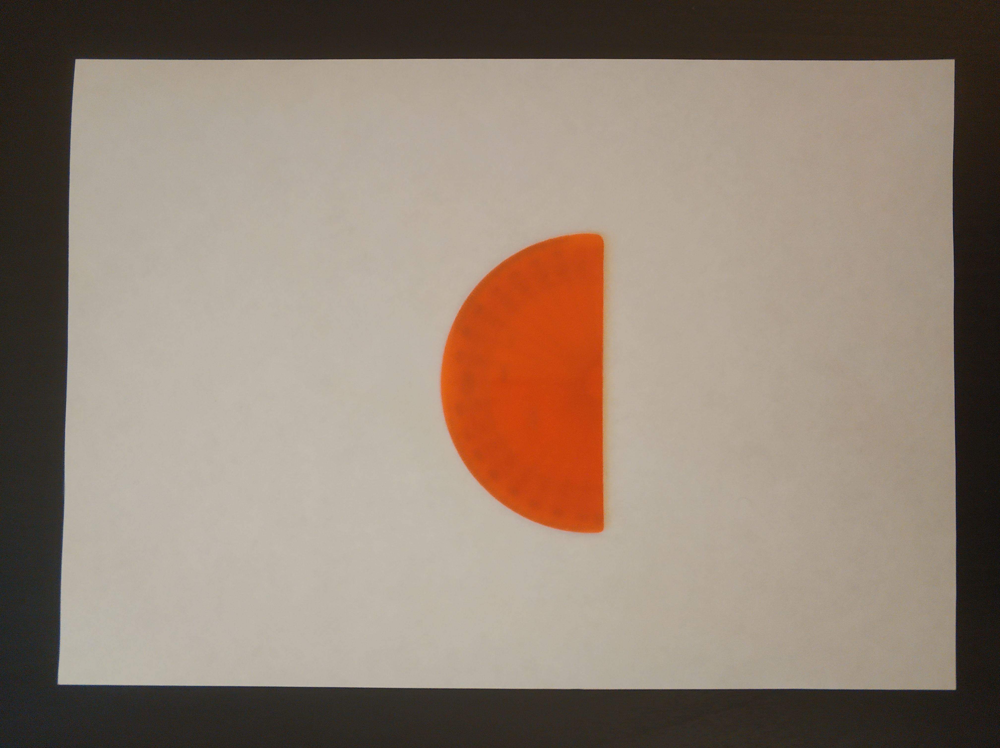
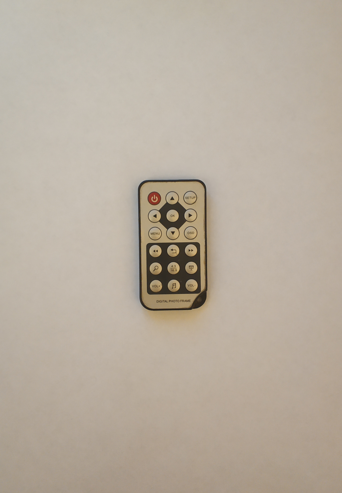
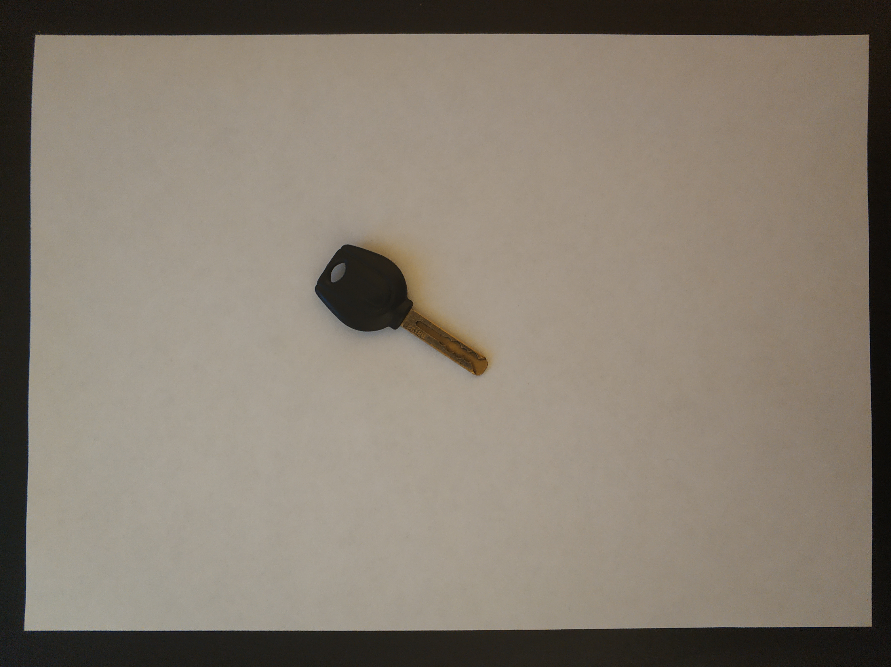
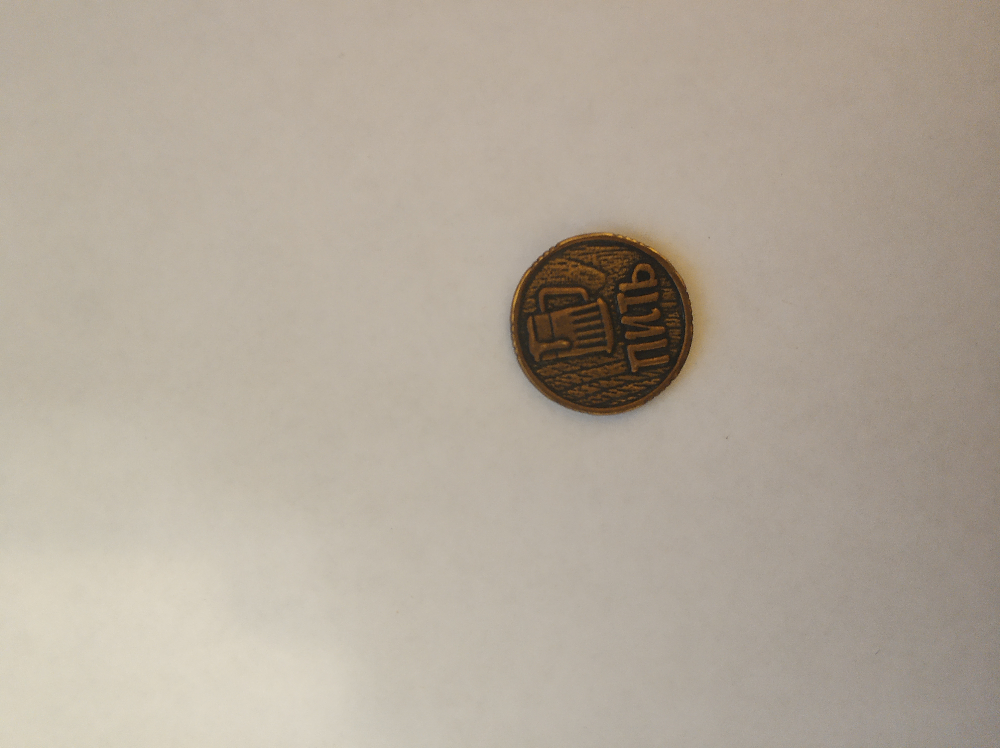
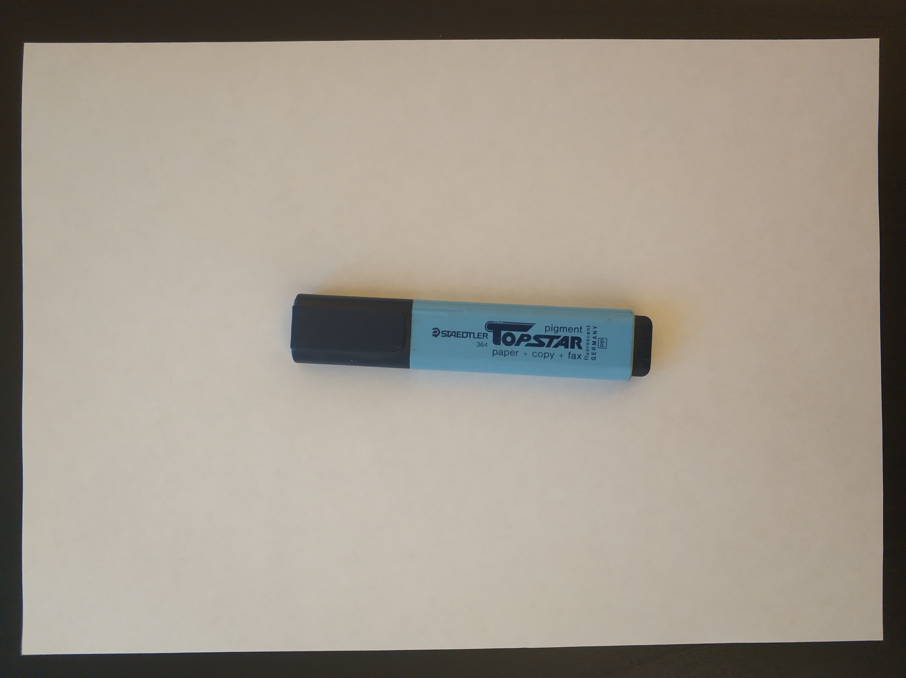
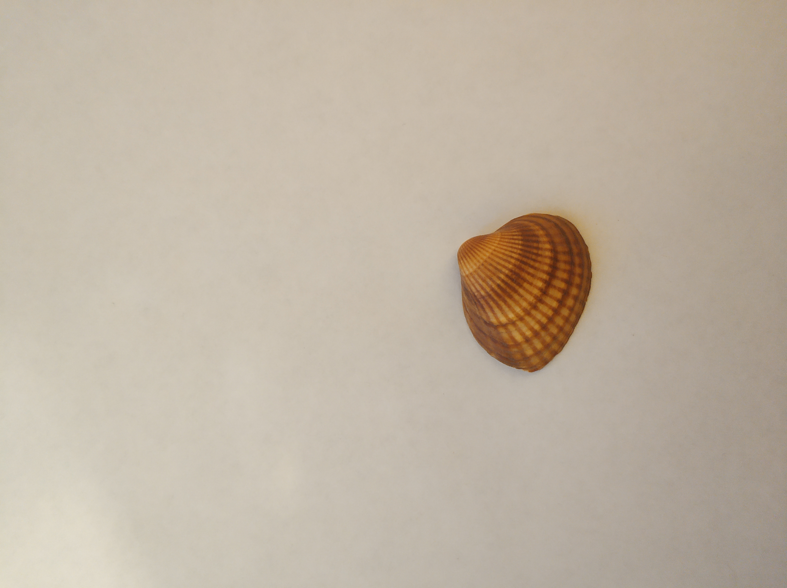

# Примитивы
В данной задаче используются 10 объектов

## Перечень объектов
0) Зажигалка

1) Канцелярский нож

2) Ручка

3) Карта открывашка

4) Транспортир

5) Пульт

6) Ключ

7) Монетка

8) Маркер

9) Ракушка

