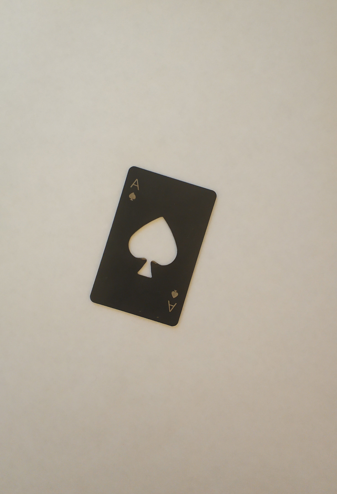
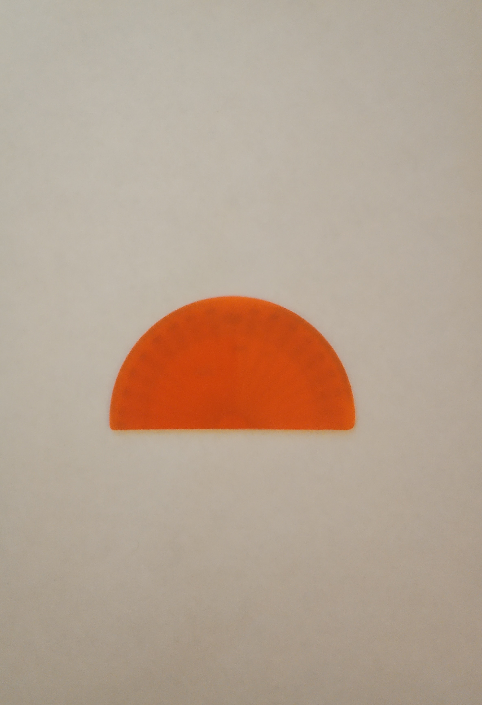
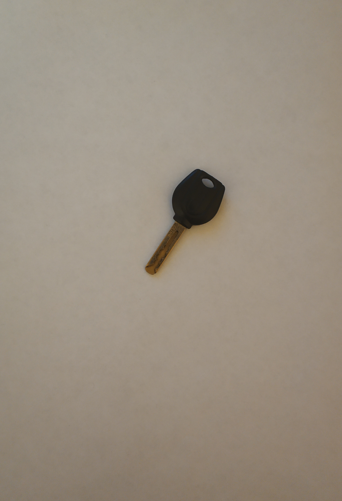
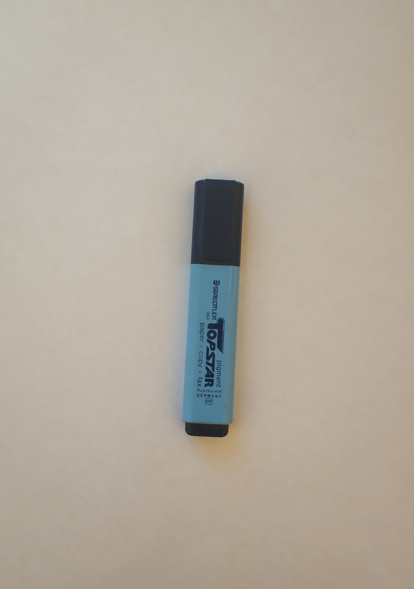
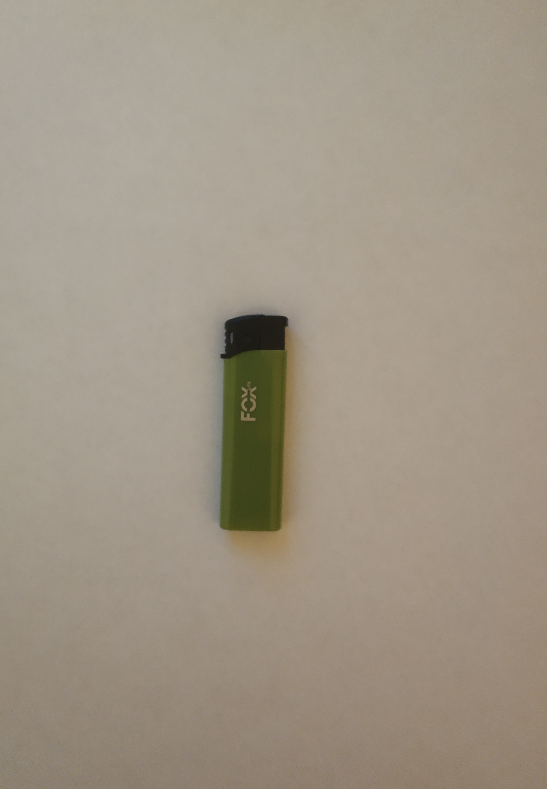
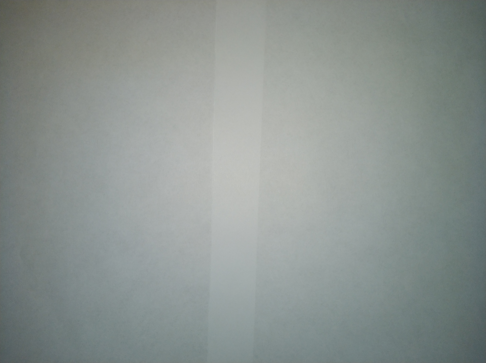

# Примитивы
В данной задаче используются 10 предметов и особая поверхность для размещения

## Перечень предметов
1. Канцелярский нож
   
2. Ручка
   
3. Карта открывашка
   
4. Транспортир
   
5. Пульт
   
6. Ключ
   
7. Монетка
   
8. Маркер
   
9. Ракушка
   
10. Зажигалка
    

## Поверхность для размещения предметов

